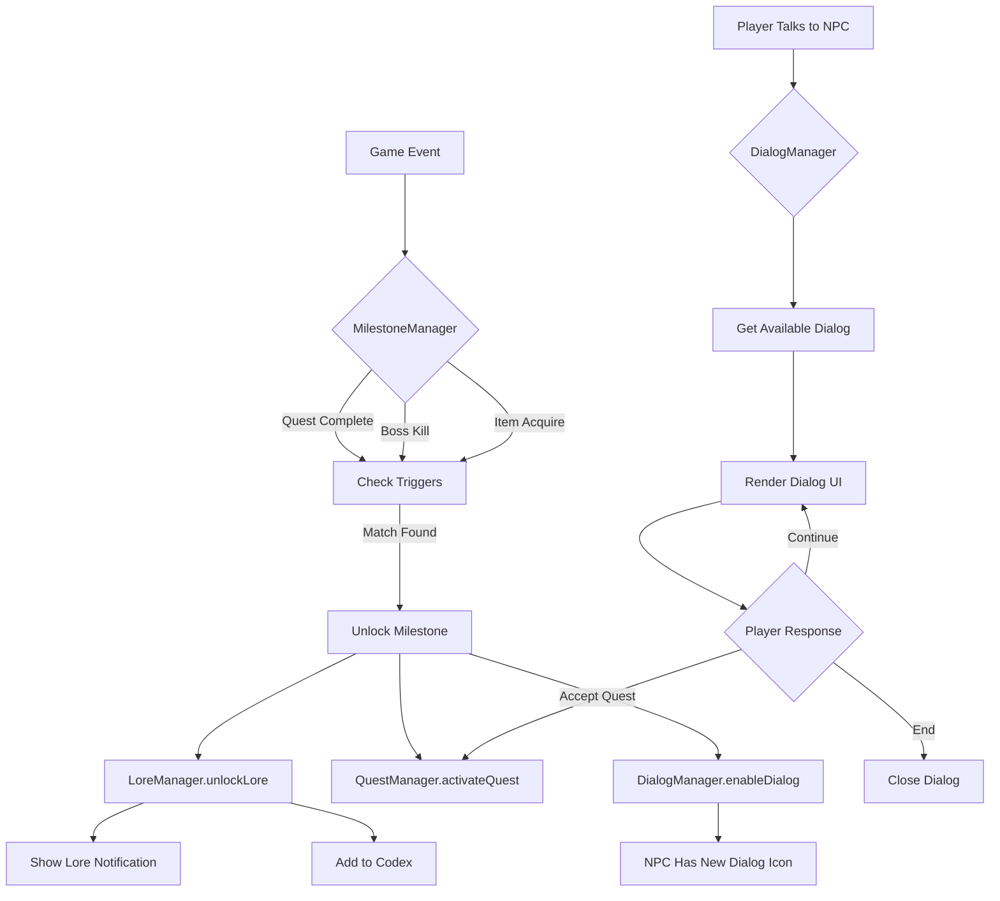

# NPC Dialog & Lore Delivery System - Implementation Plan

> **Created**: 2025-12-21
> **Status**: ✅ Approved

## Overview

Design and implement a milestone-driven system that:
1. Triggers lore reveals and quest unlocks when players hit specific milestones
2. Delivers lore through NPC dialog with conditional branching
3. Stores unlocked lore in a Codex for player reference

---

## User Review Required

## Decisions (Approved 2025-12-21)

| Decision | Choice |
|----------|--------|
| **Scope** | Chapter 1 only for initial implementation |
| **Dialog Complexity** | Branching choices that can affect outcomes |
| **Persistence** | Yes - save unlocked lore to localStorage |
| **Dialog Portraits** | Yes - display NPC portraits during conversations |
| **Side Quests** | Include side quest unlocks via milestone system |

---

## Proposed Data Structures

### milestones.json
Defines trigger conditions that unlock lore and quests.

```json
{
  "milestones": [
    {
      "id": "milestone_ch1_001",
      "name": "Chapter 1 Begins",
      "trigger": {
        "type": "game_start",
        "condition": {}
      },
      "unlocks": {
        "lore": ["lore_ch1_intro"],
        "quests": ["main_01_001"],
        "dialogs": ["elder_malik_ch1_intro"]
      }
    },
    {
      "id": "milestone_ch1_002",
      "name": "First Echo Mites Defeated",
      "trigger": {
        "type": "quest_complete",
        "condition": { "questId": "main_01_002" }
      },
      "unlocks": {
        "lore": ["lore_ch1_echo_mites", "lore_ch1_corruption_origin"],
        "quests": ["main_01_003"],
        "dialogs": ["elder_malik_mites_complete"]
      }
    },
    {
      "id": "milestone_ch1_boss",
      "name": "Echo Beholder Defeated",
      "trigger": {
        "type": "boss_kill",
        "condition": { "bossId": "echo_beholder" }
      },
      "unlocks": {
        "lore": ["lore_ch1_shard_resonance", "lore_ch1_beholder_origin"],
        "quests": ["main_01_013"],
        "dialogs": []
      }
    }
  ]
}
```

**Trigger Types**:
- `game_start` - On new game or chapter transition
- `quest_complete` - When specific quest finishes
- `quest_accept` - When player accepts quest from NPC
- `boss_kill` - When specific boss is defeated
- `item_acquire` - When player obtains key item (shards)
- `location_enter` - When player enters region/dungeon
- `level_reach` - When player hits level threshold
- `npc_talk` - When player initiates dialog with NPC

---

### lore.json
Structured lore entries that feed the Codex.

```json
{
  "categories": {
    "world": "World History",
    "characters": "Characters",
    "creatures": "Bestiary",
    "locations": "Locations",
    "items": "Artifacts & Items"
  },
  "entries": [
    {
      "id": "lore_ch1_intro",
      "category": "world",
      "title": "The Shattered Aegis",
      "chapter": 1,
      "content": "For centuries, the Aegis has protected our world from forces beyond comprehension. Now, it falters. Tremors shake the earth, and a crystalline corruption seeps from the depths...",
      "unlocked": false
    },
    {
      "id": "lore_ch1_echo_mites",
      "category": "creatures",
      "title": "Echo Mites",
      "chapter": 1,
      "content": "Small crystalline parasites that feed on resonance energy. They are not native to our realm—each one is a fragment of the Echo Primordial's dreaming will given form.",
      "unlocked": false
    },
    {
      "id": "lore_ch1_shard_resonance",
      "category": "items",
      "title": "Shard of Resonance",
      "chapter": 1,
      "content": "The first fragment recovered from the Echo Beholder's nest. This shard pulses with a frequency that harmonizes with the town's ancient obelisk. It is a key to restoring the Aegis—but also weakens the Primordial's prison with each one claimed.",
      "unlocked": false
    }
  ]
}
```

---

### dialogs.json
NPC dialog trees with conditional display.

```json
{
  "dialogs": {
    "elder_malik_ch1_intro": {
      "npcId": "npc_001",
      "lines": [
        {
          "speaker": "Elder Malik",
          "text": "Ah, you've arrived. I feared no one would answer my summons.",
          "next": 1
        },
        {
          "speaker": "Elder Malik", 
          "text": "The tremors grow worse by the day. Something stirs beneath the Watchtower.",
          "next": 2
        },
        {
          "speaker": "Elder Malik",
          "text": "We need someone capable to investigate. Will you help us?",
          "responses": [
            { "text": "I'll investigate.", "action": "accept_quest", "questId": "main_01_001" },
            { "text": "Tell me more first.", "next": 3 }
          ]
        },
        {
          "speaker": "Elder Malik",
          "text": "The corruption is called the Echo. It was sealed away long ago by the Resonance Keepers. But their Aegis is failing.",
          "next": 2
        }
      ],
      "conditions": {
        "requires": [],
        "excludes": ["main_01_001"]
      }
    },
    "elder_malik_mites_complete": {
      "npcId": "npc_001",
      "lines": [
        {
          "speaker": "Elder Malik",
          "text": "You've driven back the mites, but I fear this is only the beginning.",
          "next": 1
        },
        {
          "speaker": "Elder Malik",
          "text": "Bring me shards of the crystal corruption. The blacksmith may be able to analyze them.",
          "action": "complete_dialog"
        }
      ],
      "conditions": {
        "requires": ["main_01_002"],
        "excludes": ["main_01_003"]
      }
    }
  }
}
```

---

## Proposed Changes

### New Data Files

#### [NEW] [milestones.json](file:///c:/rpg/phaser_starter/milestones.json)
Milestone trigger definitions for Chapter 1 (expandable).

#### [NEW] [lore.json](file:///c:/rpg/phaser_starter/lore.json)
Lore entries database with unlock tracking.

#### [NEW] [dialogs.json](file:///c:/rpg/phaser_starter/dialogs.json)  
NPC dialog trees with conditions and branching.

---

### New JavaScript Modules

#### [NEW] [MilestoneManager.js](file:///c:/rpg/phaser_starter/MilestoneManager.js)
Monitors game events and checks milestone triggers.

```javascript
class MilestoneManager {
    constructor(scene) { ... }
    init() { /* Load milestones.json */ }
    checkMilestone(eventType, eventData) { /* Evaluate triggers */ }
    unlockMilestone(milestone) { /* Trigger unlocks */ }
    getMilestoneStatus(id) { /* Check if already achieved */ }
}
```

#### [NEW] [LoreManager.js](file:///c:/rpg/phaser_starter/LoreManager.js)
Tracks unlocked lore and provides Codex data.

```javascript
class LoreManager {
    constructor(scene) { ... }
    init() { /* Load lore.json */ }
    unlockLore(loreId) { /* Mark as unlocked, show notification */ }
    getUnlockedLore() { /* Return for Codex UI */ }
    getLoreByCategory(category) { ... }
}
```

#### [NEW] [DialogManager.js](file:///c:/rpg/phaser_starter/DialogManager.js)
Handles dialog rendering and player choices.

```javascript
class DialogManager {
    constructor(scene) { ... }
    init() { /* Load dialogs.json */ }
    startDialog(dialogId) { /* Begin dialog flow */ }
    showLine(line) { /* Render dialog UI */ }
    handleResponse(response) { /* Process player choice */ }
    getAvailableDialog(npcId) { /* Find valid dialog based on conditions */ }
}
```

---

### Modified Files

#### [MODIFY] [index.html](file:///c:/rpg/phaser_starter/index.html)
Add script tags for new managers.

#### [MODIFY] [npc.json](file:///c:/rpg/phaser_starter/npc.json)
Update `dialogId` to reference new dialog system (may keep for fallback).

#### [MODIFY] [game.js](file:///c:/rpg/phaser_starter/game.js)
- Initialize new managers in `create()`
- Add preload for new JSON files
- Hook milestone checks into quest completion, combat events, etc.
- Add dialog UI rendering
- Add Codex tab to existing UI system

---

## System Flow Diagram



---

## Verification Plan

### Manual Browser Testing

Since the project doesn't have automated tests, verification will be done manually in the browser:

**Test 1: Milestone Trigger on Game Start**
1. Run `start_server.bat` to launch local server
2. Open browser to `http://localhost:8000` (or configured port)
3. Start a new game
4. **Expected**: 
   - Lore notification appears: "New Lore Unlocked: The Shattered Aegis"
   - Main quest "Tremors in the Earth" appears in quest tracker
   - Elder Malik has dialog indicator (if implemented)

**Test 2: NPC Dialog Flow**
1. Walk player character to Elder Malik
2. Press interact key (Space or E)
3. **Expected**:
   - Dialog box appears with Elder Malik's introduction
   - Player can click through dialog lines
   - Response options appear on final line
   - Selecting "I'll investigate" accepts the quest

**Test 3: Quest Completion Milestone**
1. Complete "Echoes from Below" quest (kill 3 Echo Mites)
2. **Expected**:
   - Lore notification: "New Lore Unlocked: Echo Mites"
   - Next quest automatically activates
   - Elder Malik's dialog updates to new content

**Test 4: Codex UI**
1. Open game menu/UI tabs
2. Navigate to Codex/Lore tab
3. **Expected**:
   - Categories displayed (World, Characters, etc.)
   - Only unlocked entries visible
   - Clicking entry shows full lore text

---

## Implementation Order

1. Create `milestones.json` with Chapter 1 triggers
2. Create `lore.json` with Chapter 1 entries
3. Create `dialogs.json` with Elder Malik dialogs
4. Build `MilestoneManager.js`
5. Build `LoreManager.js`  
6. Build `DialogManager.js`
7. Integrate into `game.js` (preload, create, event hooks)
8. Add Dialog UI rendering
9. Add Codex tab to existing UI
10. Test full flow

---

## Open Questions

1. **Persistence**: Should unlocked lore persist to localStorage like other game state?
2. **Dialog Portraits**: Do you want NPC portraits displayed during dialog?
3. **Side Quests**: Should this system also handle side quest unlocks, or focus on main story only?
